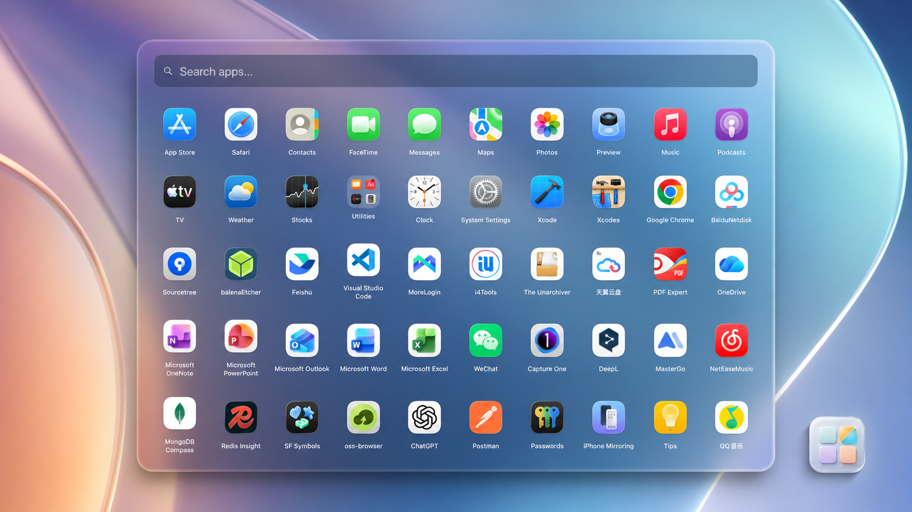

# Facet — a free classic Launchpad replacement for Mac

Facet restores the familiar fullscreen app grid, keyboard search, folders, manual ordering, and Launchpad layout import on modern macOS. The core launcher is **free forever**. Facet Pro is an optional one-time upgrade for compact mode and advanced customization.

## Download

- [Download Facet 1.0.17 DMG](https://github.com/QuartzInkStudio/Facet/releases/download/v1.0.17/Facet-1.0.17.dmg) — recommended for manual installation
- [View release notes](https://facetlauncher.com/releases)
- [Homebrew tap](https://github.com/QuartzInkStudio/homebrew-tap)

Facet 1.0.17 requires an Apple silicon Mac running macOS 14.0 or later, including macOS 26 Tahoe. The app is Developer ID signed and Apple-notarized.

| File | SHA-256 |
| --- | --- |
| `Facet-1.0.17.dmg` | `77a329d17e31746133404199c55eee8c363a26460a576e1aba8558754b9edb5f` |
| `Facet-1.0.17.zip` | `fa489f684795d26b1507a85a71b7c68fa03989a824971fbd6c1e162a34dbaff9` |

The ZIP archive attached to the GitHub release is the signed Sparkle update package. For a new installation, use the DMG.

## Facet Free and Facet Pro

| Capability | Facet Free | Facet Pro |
| --- | :---: | :---: |
| Fullscreen visual app grid | Included | Included |
| Keyboard search and app launching | Included | Included |
| Folders, manual ordering, and Launchpad import | Included | Included |
| Global keyboard shortcut | Included | Included |
| Compact launcher mode | — | Included |
| Advanced grid, scrolling, wallpaper, and glass controls | — | Included |
| Hot corner, app hiding, and aliases | — | Included |
| Dock and menu bar icon customization | — | Included |
| Price | Free forever | $14.99 USD once |

The optional **14-day Pro trial** requires no credit card and never creates an automatic charge. When the trial ends, Facet returns to the permanent Free edition and keeps the user's launcher data.

## Highlights

- **Classic visual workflow:** Browse apps by position again instead of relying only on typed search.
- **Fast access:** Open Facet from a global shortcut, the Dock, or the menu bar. Pro also adds a configurable hot corner.
- **Folders and layout import:** Preserve familiar organization or build a new custom layout.
- **Responsive app discovery:** Facet starts from a warm app catalog and reconciles newly installed apps promptly.
- **Private by design:** No product analytics, advertising telemetry, or subscription.
- **Native distribution:** Developer ID signed, Apple-notarized, and updated through a signed Sparkle feed.

## Installation

1. [Download the latest notarized DMG](https://github.com/QuartzInkStudio/Facet/releases/download/v1.0.17/Facet-1.0.17.dmg), or run `brew install --cask QuartzInkStudio/tap/facet`.
2. Open the DMG and drag Facet to the Applications folder.
3. Launch Facet and choose a global keyboard shortcut.
4. Continue with Facet Free, start the optional Pro trial, or activate a Facet Pro license.

## Screenshots

| Wallpaper mode | Keyboard search | Folders |
| :--- | :--- | :--- |
|  |  |  |

## Guides and support

- [Official Facet website](https://facetlauncher.com/)
- [Documentation](https://facetlauncher.com/docs)
- [Compare Launchpad alternatives](https://facetlauncher.com/compare)
- [Get Launchpad back on macOS 26](https://facetlauncher.com/get-launchpad-back-macos-26)
- [Release history](https://facetlauncher.com/releases)
- [Report a bug or request a feature](https://github.com/QuartzInkStudio/Facet/issues)

## 简体中文

Facet 是一款适用于 Mac 的经典 Launchpad 替代工具。全屏应用网格、键盘搜索、文件夹、排序、Launchpad 布局导入和全局快捷键永久免费。Facet Pro 是可选的 14.99 美元买断升级，提供紧凑模式、热角和高级自定义功能；也可以无信用卡试用 Pro 14 天，试用结束后自动回到免费版，不会自动扣费。

## 日本語

Facet は Mac 向けのクラシックな Launchpad 代替アプリです。フルスクリーンのアプリグリッド、検索、フォルダ、並べ替え、Launchpad レイアウトの読み込み、グローバルショートカットは無料で使い続けられます。Facet Pro は 14.99 米ドルの買い切りオプションで、コンパクトモード、ホットコーナー、高度なカスタマイズを追加します。14 日間の Pro 体験版にクレジットカードや自動課金はありません。

## 한국어

Facet은 Mac용 클래식 Launchpad 대체 앱입니다. 전체 화면 앱 그리드, 검색, 폴더, 수동 정렬, Launchpad 레이아웃 가져오기 및 전역 단축키는 계속 무료로 사용할 수 있습니다. Facet Pro는 14.99달러 일회성 선택 업그레이드로 컴팩트 모드, 핫 코너 및 고급 사용자화를 제공합니다. 14일 Pro 체험에는 신용 카드나 자동 결제가 필요하지 않습니다.

---

## Repository and license

Facet is proprietary commercial software by Quartz. This public repository is a product hub for verified release packages, public documentation, release notes, and issue tracking. **It does not contain the Facet application source code.**

GitHub automatically adds “Source code” archives to each tag. Those archives are snapshots of this public product-hub repository, not the proprietary Facet app source.
